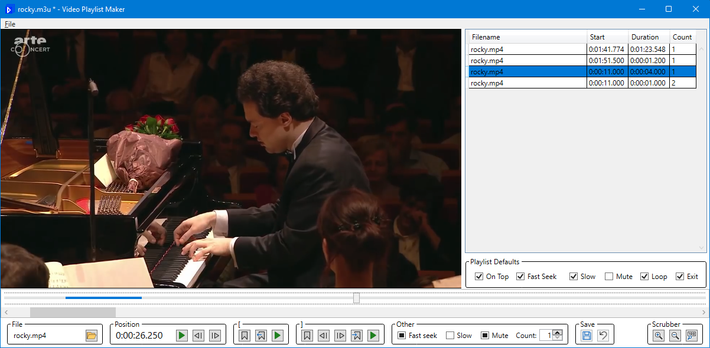

# Playlist Maker

A simplistic, crude and badly-written program for creating local video [.m3u playlists](https://wiki.videolan.org/M3U/) using [LibVLCSharp.WPF](https://code.videolan.org/videolan/LibVLCSharp) on Windows.

## Features

* [Playlist Player](https://github.com/gondwanasoft/PlaylistPlayer) can handle all options in playlists created with Playlist Maker.
* Crashes occasionally (perhaps due to race conditions or incorrect threading).
* Miscellaneous other bugs.

## Build

Use Microsoft Visual Studio 2022. You may need to install [LibVLCSharp.WPF](https://code.videolan.org/videolan/LibVLCSharp) packages.

## Usage

Optionally, Playlist Maker can open the .m3u file specified as its command line argument. This allows you to create a file association for the .m3u extension.

If a .m3u file that wasn't created by Playlist Maker is opened in Playlist Maker, you won't be able to save to the same file (unless you use `Save As`).
This is because Playlist Maker strips out .m3u directives that it doesn't support, so such directives would be lost if overwritten.

The DataGrid on the right summarises the segments (video file sections) in the playlist. There is a right-click context menu. Drag-and-drop can be used for resequencing.

The controls across the bottom of the window are used to create and edit the currently-selected segment. `[` specifies start-time; `]` specifies stop-time.

## File Format

Playlist Maker supports some of VLC's [undocumented](https://forum.videolan.org/viewtopic.php?p=530537) `#EXTVLCOPT` options (use `vlc --help` for clues). 
In addition, it implements its own non-standard `#EXPLPOPT` options for some whole-of-playlist options.

Here is an [Example.m3u](https://github.com/gondwanasoft/PlaylistMaker/blob/master/Example.m3u).

Playlists that are created by Playlist Maker should still open in VLC Player (and presumably other .m3u-compatible programs), but unsupported options will be ignored.

See the [Playlist Player README](https://github.com/gondwanasoft/PlaylistPlayer/blob/master/README.md) for a list of .m3u options that are supported by Playlist Maker.